<h1 align="center">Lumo — User Guide</h1>

A practical, feature-by-feature guide to <b>Lumo</b>, the mpv-based video player.

> This guide covers everything Lumo can do, grouped by task. Default keyboard
> shortcuts are shown in `code`, but **every shortcut is rebindable** in
> **Settings → Keyboard Shortcuts** — press `?` (or `F1`) any time for the live,
> authoritative list.

---

## Contents

1. [Getting Started](#1-getting-started)
2. [The Menu Bar & Command Palette](#2-the-menu-bar--command-palette)
3. [Playback](#3-playback)
4. [Opening Media](#4-opening-media)
5. [Picture Quality & Grading](#5-picture-quality--grading)
6. [AI Colour Correction (cloud)](#6-ai-colour-correction-cloud)
7. [Framing & Window](#7-framing--window)
8. [Audio](#8-audio)
9. [Subtitles](#9-subtitles)
10. [Scenes & Chapters](#10-scenes--chapters)
11. [Capturing & Exporting](#11-capturing--exporting)
12. [Keyboard Shortcuts](#12-keyboard-shortcuts)
13. [Settings Reference](#13-settings-reference)
14. [Troubleshooting](#14-troubleshooting)

---

## 1. Getting Started

Install Lumo from the [releases page](https://github.com/eashwar83/lumo/releases),
launch it, and either drag a video onto the window or use **Media → Open File…**
(`Ctrl+O`).

When a video is playing, move the mouse to reveal the on-screen chrome: the
**menu bar** across the top, the **player header** (title, window controls), and
the **control bar** along the bottom. Leave the mouse idle and it all fades so
the picture is unobstructed.

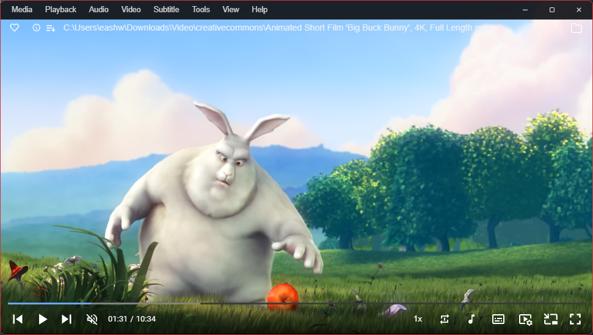

The **home screen** (shown when no video is loaded) is your hub for Recent,
Favourites, and network sources.

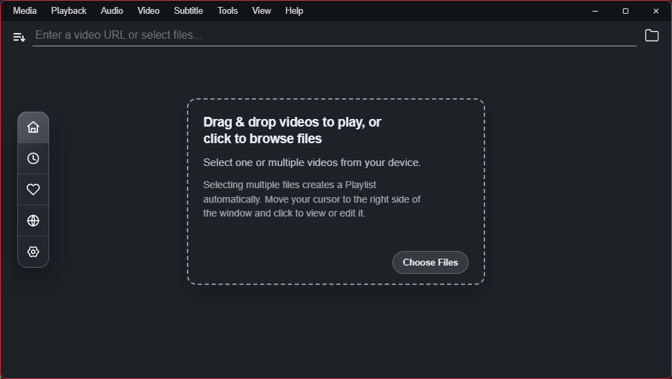

---

## 2. The Menu Bar & Command Palette

The **menu bar** is a familiar, VLC-style row: **Media, Playback, Audio, Video,
Subtitle, Tools, View, Help**. Every action in Lumo is reachable here — it's an
additional route to features, never a second implementation. Hover a title to
open it; hover across to switch menus. Press `Esc` to close.

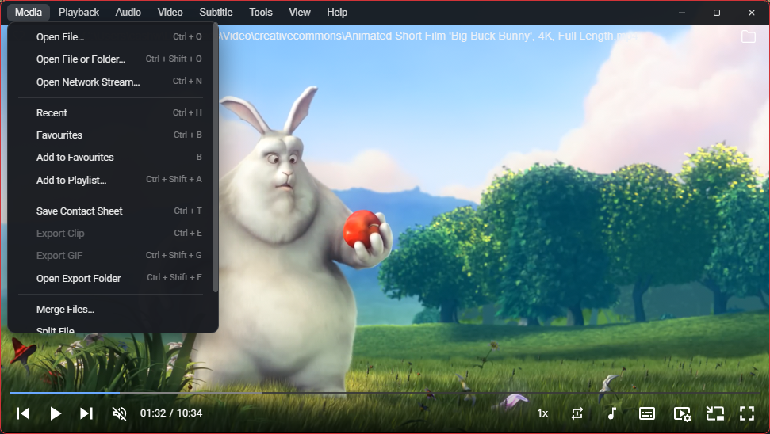

Prefer the keyboard? The **Command Palette** lets you search and run any action
by name. Open it, type a few letters, and hit Enter.

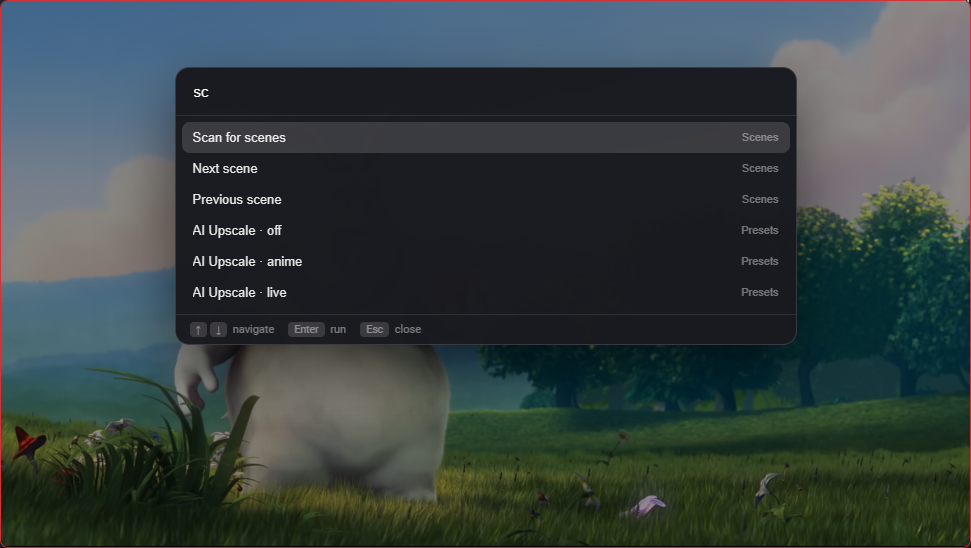

You can hide the menu bar entirely from **View → Hide Menu Bar**; it stays
available through the header and shortcuts.

---

## 3. Playback

The control bar carries play/pause, the seek bar (with hover thumbnails), volume,
time, and quick-access buttons.

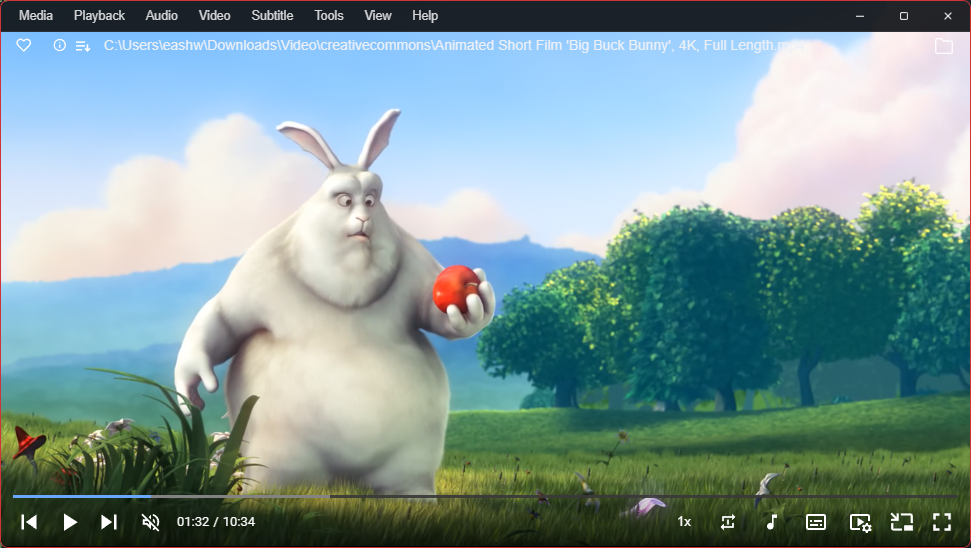

Common controls (defaults — all rebindable):

| Action | Default |
| --- | --- |
| Play / pause | `Space` or `K` |
| Seek ±5 s | `←` / `→` |
| Seek ±1 s (exact) | `Shift+←` / `Shift+→` |
| Seek ±60 s | `PgUp` / `PgDn` |
| Jump to start | `Home` |
| Frame step back / forward | `,` / `.` |
| Speed down / up | `[` / `]` |
| Normal speed | `Backspace` |
| Loop file | `L` |

**Ultra Slo-Mo** — hold the slo-mo key (default `X`) while playing for a
temporary ½ / ¼ / ⅛-speed slow motion; release to resume. Fixed factors are also
in **Playback → Ultra Slo-Mo**.

**A-B range & loop** — mark an in-point and an out-point to define a range, then
loop it. Use it to study a passage or to seed a clip/GIF export or a skip marker.

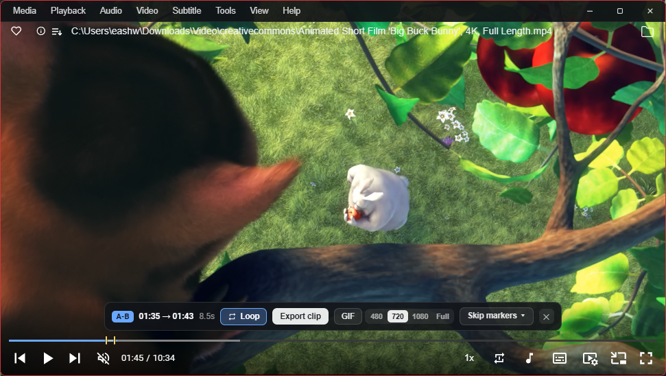

**Skip intro / credits** — save an A→B range as the "intro" and a point as
"credits start" for a folder (**Playback → Skip Markers**). Turn on **Skip
Automatically** and Lumo jumps past them on every file in that folder.

---

## 4. Opening Media

- **Files & folders** — **Media → Open File…** (`Ctrl+O`) or **Open File or
  Folder…**. Opening a local file **auto-loads its whole folder** into the
  playlist, so Previous/Next (`<` / `>`) walk the folder in order.
- **Recent** — jump back into anything you've watched; playback resumes where you
  left off.
- **Favourites** — mark the current video with the top-bar heart (`B`), then
  browse a thumbnail grid of favourites. A Favourites list in the playlist drawer
  lets Previous/Next walk your favourites.
- **Network streams** — **Media → Open Network Stream…** for WebDAV, DLNA, SMB,
  and M3U/IPTV sources, with discovery, browsing, and smart buffering.

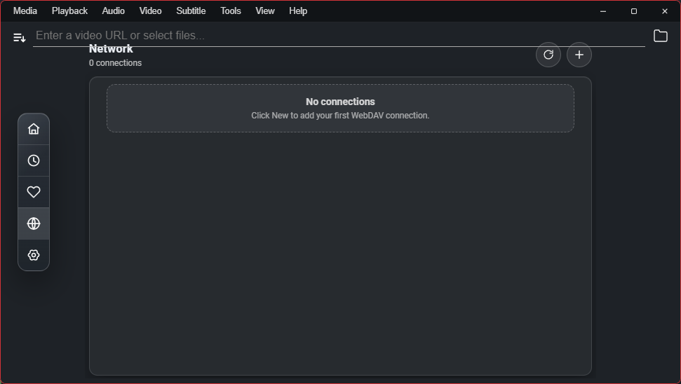

The **playlist drawer** (`Tab`) shows the current queue; drag to reorder.

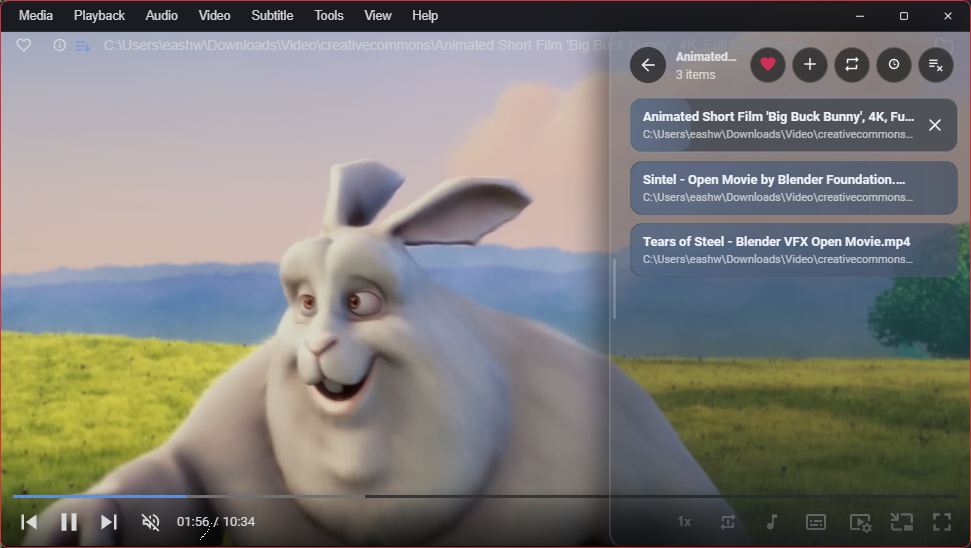

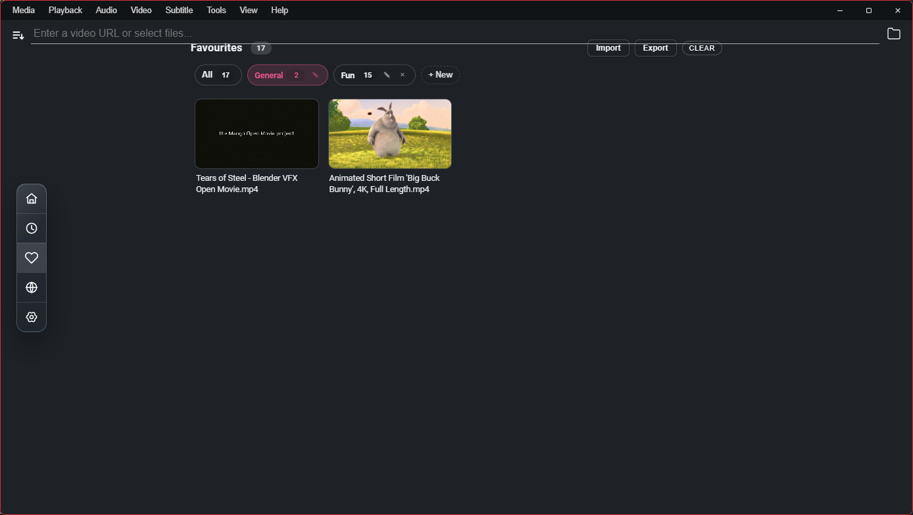

---

## 5. Picture Quality & Grading

Everything here lives in the **Video** popover — click the **gear icon** in the
control bar (or use the **Video** menu). All adjustments are GPU-based (no decode
penalty) and are **remembered per file**, restoring automatically when you reopen
a video.

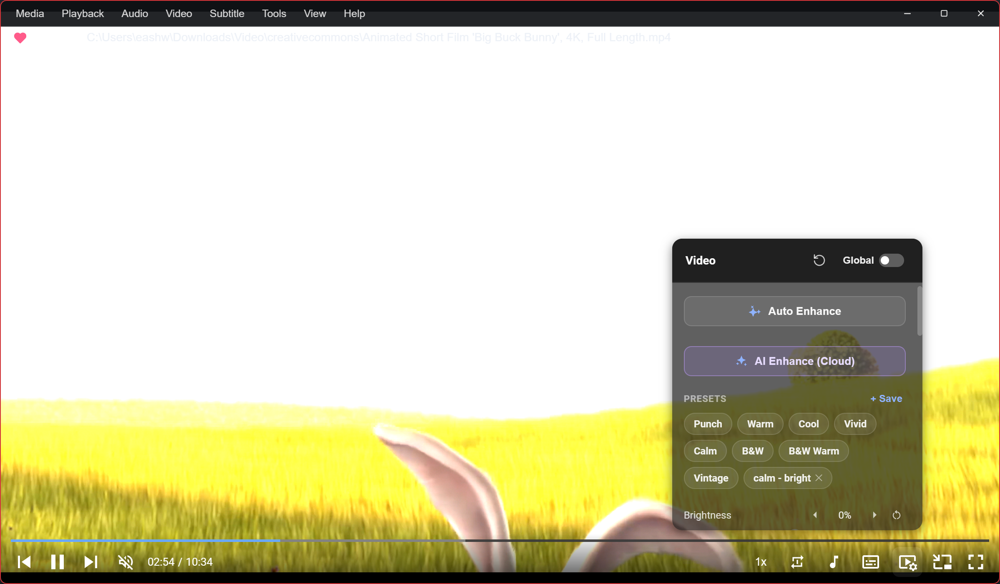

### Auto Enhance

One press samples the current frame and fills the sliders to fix **levels
(contrast), exposure (brightness), colour cast (white balance), and dull colour
(saturation)**. It's algorithmic — instant, offline, and a great starting point
you can fine-tune by hand.

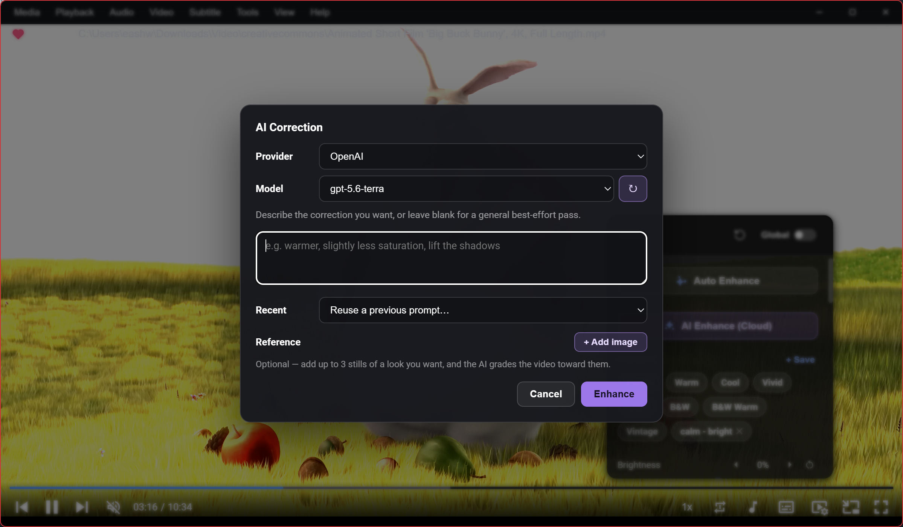

### Colour grade

Film-style GPU sliders: **Exposure, Temperature, Tint, Highlights, Shadows**,
plus the classic **Brightness / Contrast / Saturation / Gamma / Hue**.

### Curves editor

Open the **Curves** panel for per-channel tone curves (master RGB plus R/G/B for
white-balance work). The **Auto** button computes a gentle 20-frame auto-levels
curve you can then refine by dragging control points.

### Sharpness & film grain

- **Sharpness** — a GPU unsharp mask with independent **Amount** and **Radius**
  (small radius = crisp edges; large radius = broad local-contrast / "HDR" glow).
- **Film Grain** — animated, luminance-aware grain for a filmic texture, useful
  for masking banding on flat digital gradients.

### Cleanups & scaling

- **Denoise** and **Deinterlace** toggles for noisy or interlaced sources.
- **Deband** (Off / Light / Medium / Strong) to smooth colour banding.
- **Old Film Restore** — a one-click cleanup pass for aged footage.
- **Quality presets** (Fast / Balanced / High) tune mpv's scaler and debanding.
- **AI Upscaling** — one-click **Anime4K** (anime) and **ravu** (live-action)
  upscalers.

### Looks & presets

Eight built-in looks — **Punch, Warm, Cool, Vivid, Calm, B&W, B&W Warm,
Vintage** — plus **save your own** named presets into a reusable library.

The complete look (all sliders + colour grade + sharpen/denoise/deinterlace/grain
+ curves) is stored **per file**. A **Reset** button clears the current video's
look; a **Global** toggle applies one look to every video instead.

### Before / After split view

Toggle **Before / after split view** (Video menu) to split the frame down the
middle — your graded look on one side, the untouched original on the other — so
you can judge the change in context. It's HDR-correct: both halves are
tone-mapped identically.

### View Original, Undo & Redo

- **View Original** (`\`) — instantly bypasses *all* enhancements (picture **and**
  audio) to show the untouched source, without changing your saved settings.
  Press again to return. Making a new change while viewing the original snaps you
  back to the enhanced view.
- **Undo / Redo** (`Ctrl+Z` / `Ctrl+Shift+Z`) — step back and forth through your
  changes. History is kept **per file** (up to 20 steps) and survives restarts.
  An on-screen readout shows your position, e.g. `Change 3/5`.

---

## 6. AI Colour Correction (cloud)

Beyond the offline Auto Enhance, Lumo can send a handful of frames to a **cloud
vision model** and ask for a tailored correction — per-channel **curves**, plus
**saturation, temperature/tint, sharpness, and film grain** — applied as a single
undoable step. Bring your own API key; frames are uploaded only to the provider
you choose, and your key stays on the device.

Supported providers: **Gemini, Claude, OpenAI, Kimi (Moonshot), Qwen, DeepSeek,
Grok**, or any **custom OpenAI-compatible** endpoint.

### One-time setup

Open **Settings → Advanced → AI Enhance**. Pick a provider, paste its **API key**
(stored per-provider), optionally set a **Base URL** (for regional/workspace
endpoints), and pick a **Model**. **Fetch latest models** pulls the current model
list for your key.

> Choose a **vision-capable** model — for image analysis, pick one with `vl` or
> `vision` in its name. Text-only models will error.

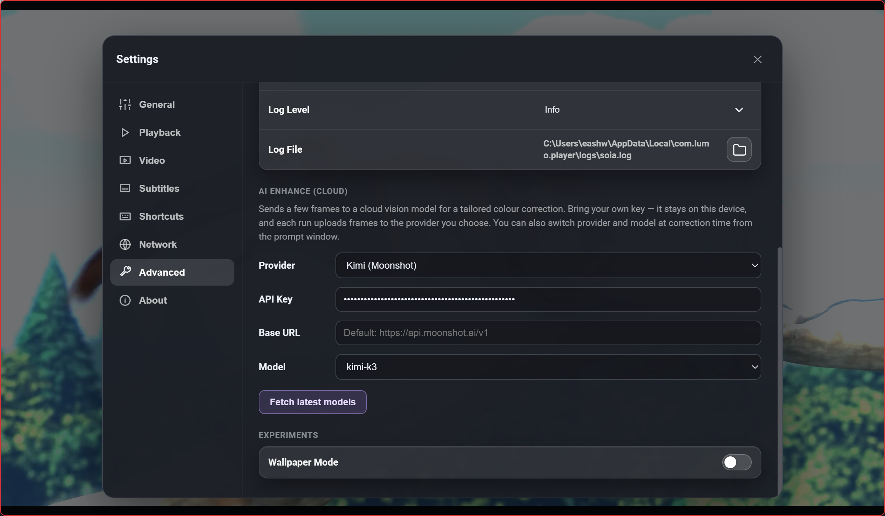

### Running a correction

Use **AI Enhance** in the Video popover (next to Auto Enhance), or **AI Correct**
in the Curves panel. A prompt window opens where you can:

- Type an optional **instruction** ("warmer, less saturation, lift the shadows"),
  or leave it blank for a general best-effort pass.
- Switch **provider** and **model** right here, and fetch models with `↻`.
- Reuse a previous prompt from the **Recent** dropdown (it refills the text and
  restores that provider/model).

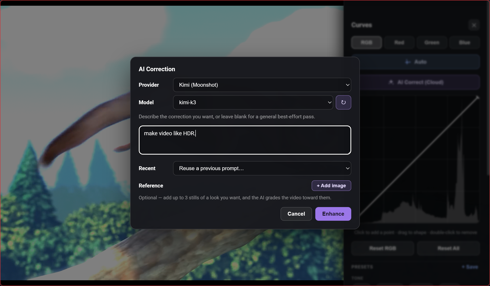

### Reference images

Add up to **three reference stills** of a look you want, and the AI grades the
video *toward* them — matching their palette, contrast, warmth, and mood (their
content is ignored). References are kept while the app is open.

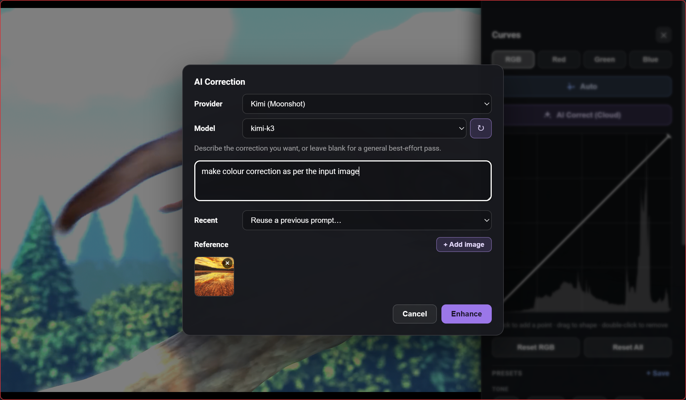

### Seeing what the AI did

When you cycle back to an AI-made change with `Ctrl+Z` / `Ctrl+Shift+Z`, the
readout shows the **model used**, the **prompt**, and the model's own **result
notes** — so your history is self-documenting.

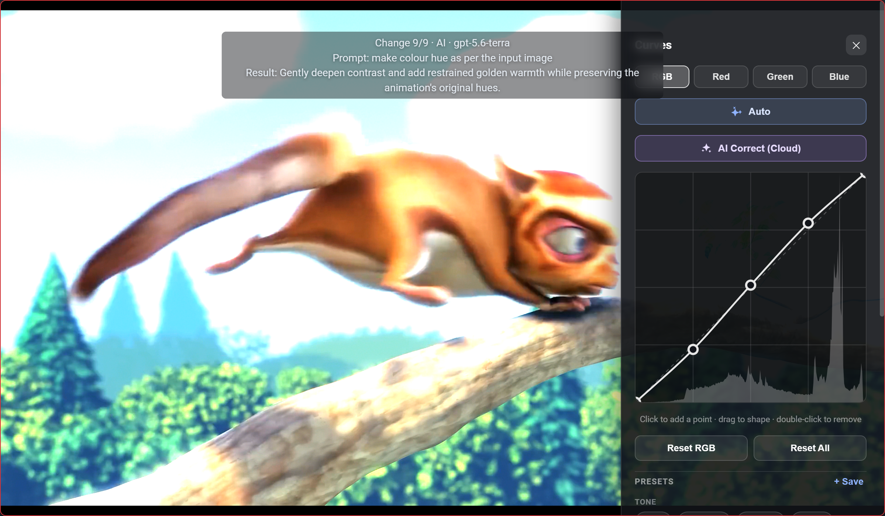

---

## 7. Framing & Window

- **Aspect ratio** (`E`) — cycle Default / 16:9 / 4:3 / 21:9 / 2.35:1, remembered
  per file; the window auto-fits to remove letterboxing.
- **Crop** — **Auto-Crop Black Bars** (`C`) uses mpv `cropdetect`; the detected
  crop is remembered per file. **Clear Crop** with `Shift+C`. A black-level
  threshold is available for noisy/analog sources.

x`x`x`x`

- **Zoom / Pan / Rotate** — zoom in/out, pan the zoomed frame, and rotate in 90°
  steps (**Video → Zoom / Rotate**), with a one-key reset.

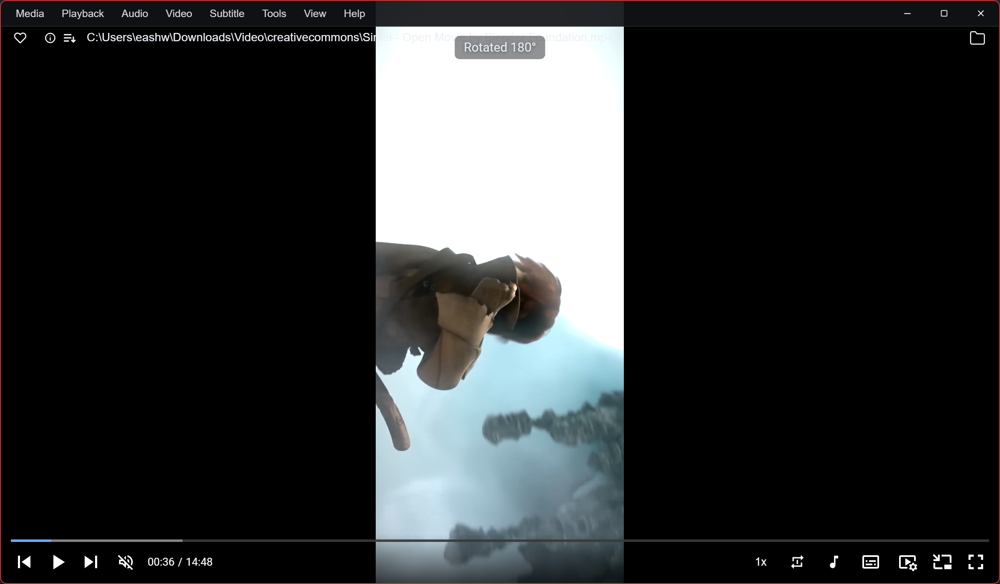

- **Fit window to video** (`G`), **step window resize** keeping aspect
  (`Alt` +/−), and a **window-size lock** to hold one size across all videos.
- **Always on top** (`T`), **Picture-in-Picture** (macOS & Windows), and an
  experimental **Wallpaper Mode** (Windows).

---

## 8. Audio

Open the **Audio** panel (or the **Audio** menu) for the full mixer.

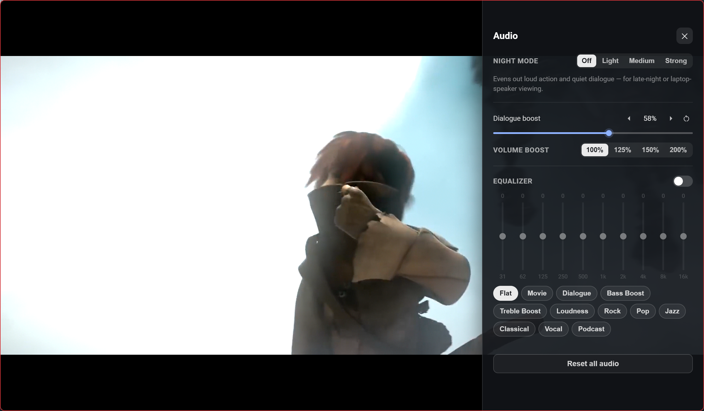

- **Tracks** — switch audio track (`A`), or add an external audio file.
- **Volume** — `↑`/`↓` (or `9`/`0`) to adjust, `M` to mute; **Volume Boost**
  (100–200%) for quiet sources.
- **Night Mode** — dynamic-range compression (Light / Medium / Strong) that tames
  loud peaks and lifts quiet dialogue for late-night listening.
- **Equalizer** — a multi-band EQ with presets; enable and tweak per taste.
- **Audio delay** — nudge A/V sync earlier/later (`Ctrl+-` / `Ctrl+=`).

---

## 9. Subtitles

From the **Subtitle** menu:

- **Track** — switch subtitle track (`J` / `Shift+J`), toggle visibility (`V`),
  or **add a subtitle file**.
- **Dual subtitles** — show two tracks at once for bilingual viewing.
- **Delay** — shift timing (`Z` / `Shift+Z`), or **Sync to this moment** to align
  the current line by ear.
- **Advanced** — font, size, colour, and position controls.

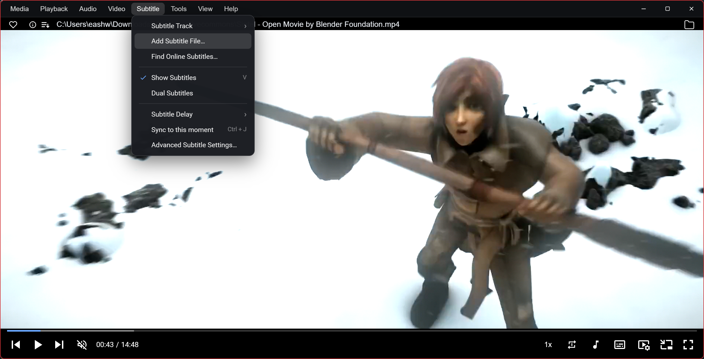

**Online subtitle search** — **Find Online Subtitles…** searches OpenSubtitles
and SubSource, with fuzzy matching for local and network media.

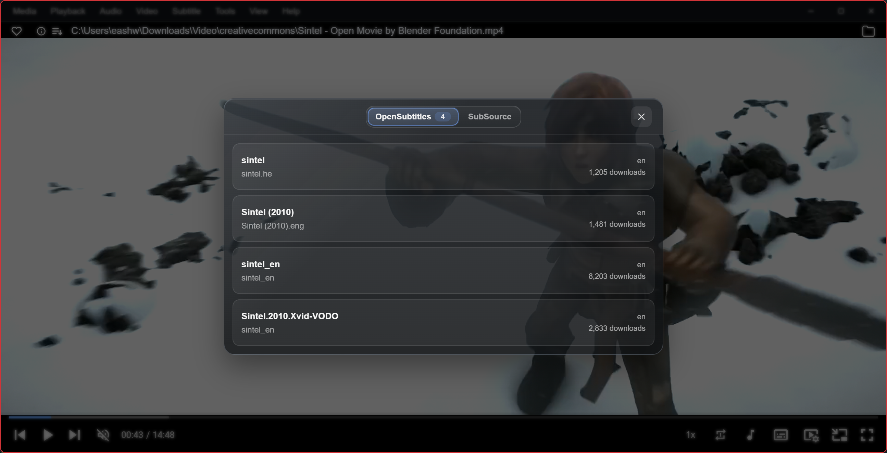

---

## 10. Scenes & Chapters

Lumo can **detect scene cuts** in a local file (or read embedded **chapters**).
Once scanned, jump between them with Next/Previous (**Playback → Scenes /
Chapters**), and the seek bar shows scene marks.

---

## 11. Capturing & Exporting

### Screenshots

Capture the current frame with `S` (with subtitles) or `Shift+S` (video only).
Files land in your configured screenshot folder.

### Contact sheet

**Media → Save Contact Sheet** (`Ctrl+T`) tiles a grid of evenly-spaced frames
into one timestamped image — a quick visual overview of an entire video.

### Clip & GIF export

Set an A-B range, then **Export Clip** (`Ctrl+E`) for a **lossless** stream-copied
video, or **Export GIF** (`Ctrl+Shift+G`) for an animated GIF (built in-process,
no external tools). **Open Export Folder** (`Ctrl+Shift+E`) reveals the results.

> Clip export needs a full **ffmpeg** — see [Troubleshooting](#14-troubleshooting).

### Merge files

**Media → Merge Files…** combines several clips into one, in the order you set.
Same-format files merge **losslessly and instantly** (stream copy); if the files
differ in codec/resolution, Lumo offers a **re-encode** so they still combine.
Add files, reorder with ↑/↓, then **Merge & Save…** — the result opens in the
player.

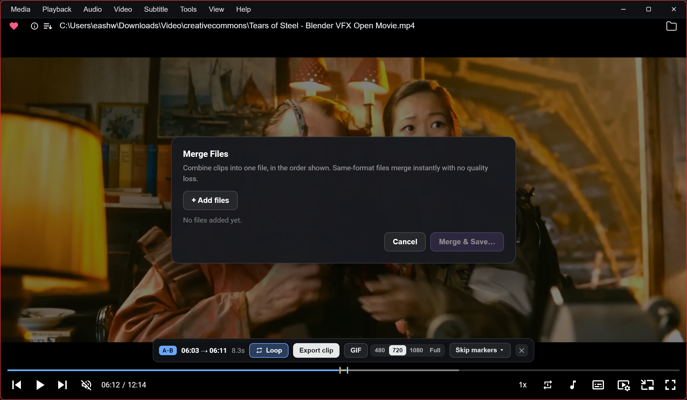

### Split file

**Media → Split File…** cuts one file into pieces **without re-encoding**. Choose
how to split: **manual timestamps** (with "add current position"), **equal
parts**, **every N minutes**, or **at chapters**. Pick an output folder and base
name, and Lumo produces `name-001`, `name-002`, …

> Lossless split points snap to the nearest keyframe, so a cut can land a couple
> of seconds early — that's inherent to not re-encoding.

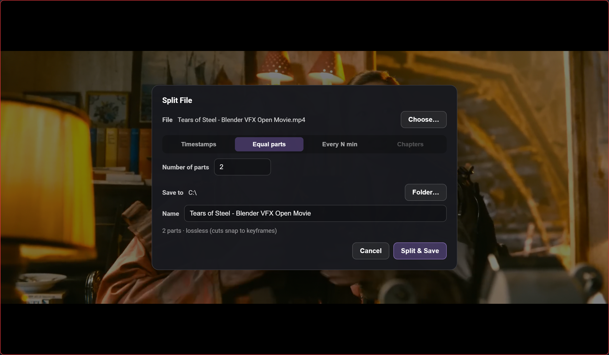

> **Merge and Split both need a full ffmpeg** (the bundled one is playback-only).
> Set its path in **Settings → Advanced** — see
> [Troubleshooting](#14-troubleshooting).

---

## 12. Keyboard Shortcuts

Press `?` or `F1` for a live help overlay listing every shortcut. Every action is
**rebindable** in **Settings → Keyboard Shortcuts**, and the menu bar shows the
current accelerator next to each item.

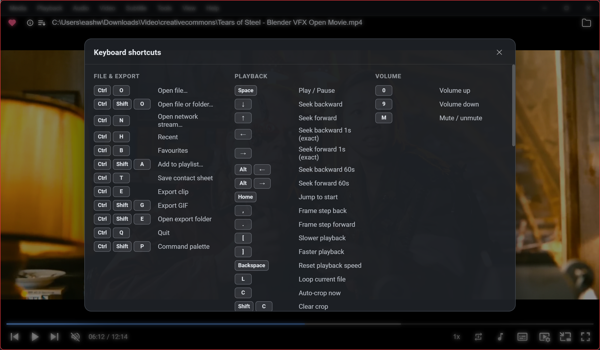

`Esc` closes overlays one layer at a time — dialogs first, then panels, then the
playlist, and finally exits fullscreen.

---

## 13. Settings Reference

Open **Settings** (Tools → Preferences…). Highlights of **Advanced**:

- **ffmpeg path** — point Lumo at a full ffmpeg (enables Clip export, Merge, and
  Split). You can select either the `ffmpeg.exe` or the folder that contains it.
- **Seek-bar thumbnails** — toggle hover previews and set the capture interval.
- **AI Enhance** — providers, API keys, base URLs, and default model.
- **Keyboard Shortcuts** — rebind any action.

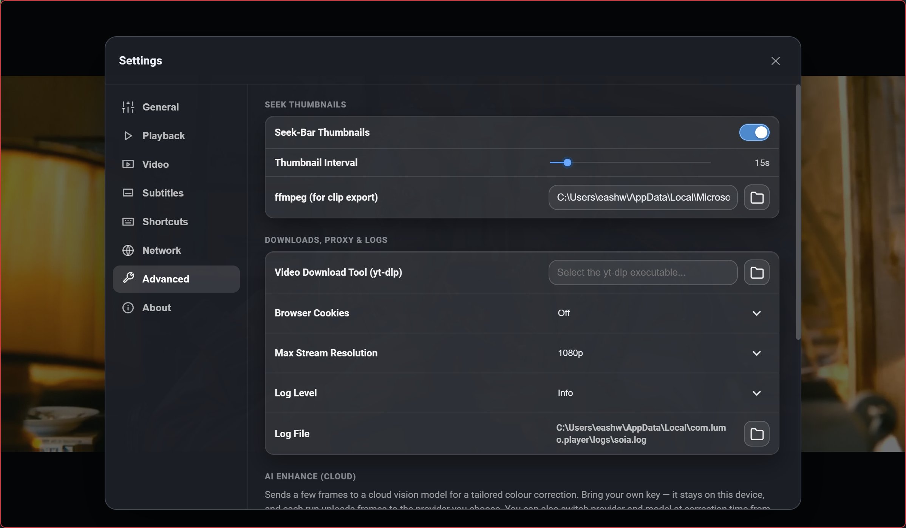

---

## 14. Troubleshooting

**"Merge Files… / Split File… / Export Clip" are greyed out.**
These need a *full* ffmpeg — the ffmpeg bundled with Lumo is playback-only (no
muxers). Install ffmpeg (e.g. `winget install Gyan.FFmpeg`) so it's on your PATH,
**or** set its path in **Settings → Advanced**. Lumo re-checks when you open a
menu or close Settings, so they enable as soon as a valid ffmpeg is found. You can
point at the `ffmpeg.exe` itself or its containing folder.

**AI correction fails with a 400 / "messages input is invalid".**
The selected model probably can't read images. Pick a **vision** model (name
contains `vl` or `vision`). For Qwen International/workspace keys, set the regional
**Base URL** (ending in `/compatible-mode/v1`) in AI Enhance settings.

**AI correction fails with a key/region error (401).**
Double-check the API key for that provider, and set the correct regional **Base
URL** if your account isn't on the default endpoint.

**Split cuts land a little early.**
Lossless splitting can only cut on a keyframe. This is expected — the alternative
would require re-encoding the whole file.

---

Lumo is a fork of <a href="https://github.com/FengZeng/soia">Soia</a>, licensed under GPL-3.0.

